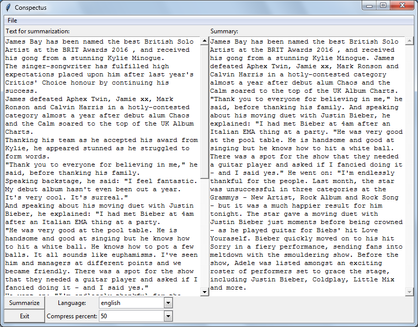

Python implementation of standalone desktop GUI-application for automatic extractive text summarization with multi language support. Based on submodular functions http://melodi.ee.washington.edu/people/hlin/papers/lin2009-submodsum.pdf

For determining sentence similarity was using phrasal overlap based on Lesk algorithm.http://www.cis.drexel.edu/faculty/thu/research-papers/dawak-547.pdf

This application support 14 languages: danish, dutch, english, finnish, french, german, hungarian, italian, norwegian, portuguese, romanian, russian, spanish, swedish. 

Ubuntu installation instruction:
sudo apt-get install python3-tk
sudo pip3 install networkx nltk

Using dependencies: NetworkX, NLTK
